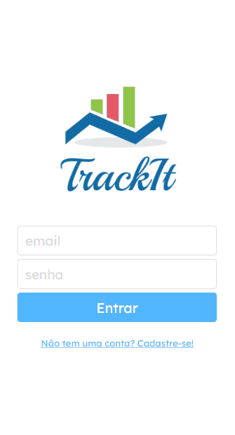

# TrackIt
An app to manage your habits. Create new habits and track them daily to try to achieve your goals.

    

Try it out now at https://track-it-lyart.vercel.app/

# About
This is a web application with which many people can manage their own habits. Below are the implemented features:

* Sign up
* Log in
* List all a user's habits
* Select the habits performed on the day
* Add habit

By using this app, any user can know how they are progressing with some habits.

# Technologies
The following tools and frameworks were used in the construction of the project:

    
    
    
    

